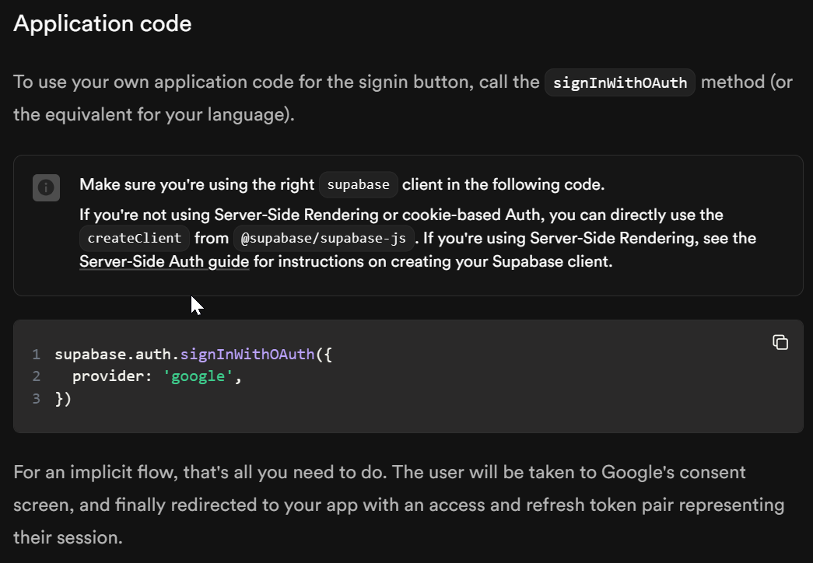

# 📖 Chapter 0: Previous Work

There are some resources to look at if you have chosen the Streamlit-Supbase stack. Here are some of them:

1. [Connect Streamlit to Supabase, Streamlit Docs](https://docs.streamlit.io/develop/tutorials/databases/supabase)

    a. There are two ways to connnect, one is [Streamlit Supabase Connector](https://st-supabase-connection.streamlit.app/) (a community-built connection developed by @SiddhantSadangi), and the other is using the Supabase Python Client.
    b. Both are pretty straightforward, however, if you want to use Google OAuth, you will have to use the Supabase Python Client.

2. [Supabase Python Client, Supabase Docs](https://supabase.com/docs/reference/python/introduction)

    a. The Supabase Python Client explains how to use the Supabase API with Python. It is not extensively detailed as the JavaScript client, but it is enough to get you started.

3. [Streamlit-Supabase Demo App](https://supabase-demo.streamlit.app/)

    a. This is a demo app that uses Streamlit and Supabase. It is a good starting point to understand how to use Supabase with Streamlit, if you are working with the database.
    b. It also has examples to use for the Email and Password authentication, but not for Google OAuth.

## Google OAuth in Streamlit

Supabase's [Python Client](https://supabase.com/docs/reference/python/introduction) provides the [Sign in user through OAuth](https://supabase.com/docs/reference/python/auth-signinwithoauth), however, there is very litte detail as to how it's supposed to work. The link to [third party providers](https://supabase.com/docs/guides/auth#providers) leads you to [Login With Google](https://supabase.com/docs/guides/auth/social-login/auth-google?queryGroups=platform&platform=web&queryGroups=environment&environment=client&queryGroups=framework&framework=express) which has guides for various clients, but not for Python.
 As of 10-08-2021 .

The [Sign in user through OAuth](https://supabase.com/docs/reference/python/auth-signinwithoauth) method is supposed to authenticate users using OAuth providers like Google, but doesn't directly open the OAuth provider's login page as mentioned.

The **recommended** approach is to either use a different stack or use a backend server to handle the OAuth flow with PKCE. 

## What people have tried online:

Most of the topics on [Streamlit Discussion Forums](https://discuss.streamlit.io/) regarding Supabase-Streamlit are closed without solutions. 

The ones mentioning Supabase and Google OAuth are:

1. [Supabase Google Oauth](https://discuss.streamlit.io/t/supabase-google-oauth/57306/2)
    a. This component adds several SSO providers to Streamlit, but it also adds 'Sign up with Email' and 'Sign in with Email' buttons. If you only want Google OAuth, you will have to modify the component upstream, and possibly rebuild it locally or make a PR.
2. [How can streamlit app utilize Supabase to achieve Google login? I have encountered some problems](https://discuss.streamlit.io/t/how-can-streamlit-app-utilize-supabase-to-achieve-google-login-i-have-encountered-some-problems/53299)
3. [Simple Streamlit Google OAuth](https://discuss.streamlit.io/t/simple-streamlit-google-oauth/25629)
    a. This one might work, but a comment mentions that [it doesn't work in production.](https://discuss.streamlit.io/t/simple-streamlit-google-oauth/25629/5)
    b. [This other comment explains why](https://discuss.streamlit.io/t/simple-streamlit-google-oauth/25629/9)
    c. This implementation also doesn't persist login, so the user has to login every time the app is opened. This can be fixed by using cookies or local storage.

### Untried Solution

[Google Authentication in a streamlit app](https://discuss.streamlit.io/t/google-authentication-in-a-streamlit-app/43252/27) seems promising. I haven't tried it yet, but comments mention that it doesn't work in production. It uses a different library to handle the OAuth flow.

### Local Storage in Streamlit

There is no direct way to use local storage in Streamlit. However, there is a discussion [Saving data in local storage via streamlit](https://discuss.streamlit.io/t/saving-data-in-local-storage-via-streamlit/28785/1) which has possible solutions. This would be used for persisting the token pair after the user logs in.

### Cookies in Streamlit

I have not explored using cookies in Streamlit yet, but it is a possible solution to persist the token pair after the user logs in. [Streamlit cookies - Which package to use? So many of them?](https://discuss.streamlit.io/t/streamlit-cookies-which-package-to-use-so-many-of-them/50500/1) is a discussion that might help.

---

[Chapter 1: Prerequisites for Supabase and Streamlit](chapter1.md) ⇨